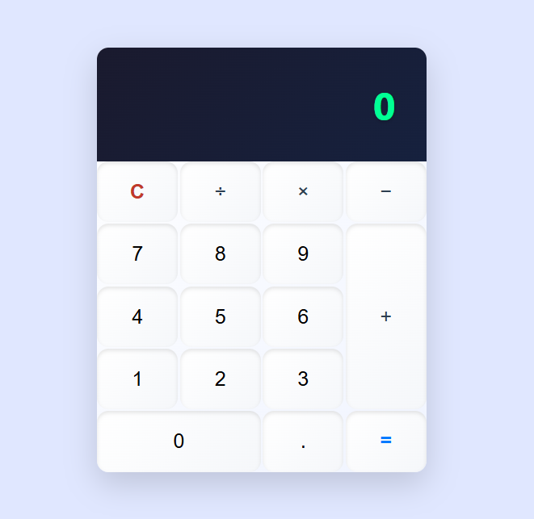

# 🧮 Calculatrice Web

Une calculatrice simple, élégante et responsive réalisée en **HTML**, **CSS** et **JavaScript**.  
Elle permet d'effectuer les opérations de base : addition, soustraction, multiplication et division.

## 🚀 Fonctionnalités

- Interface intuitive et responsive
- Opérations de base : `+`, `−`, `×`, `÷`
- Gestion des erreurs (ex. division par zéro)
- Affichage dynamique
- Design moderne avec effets de survol et de clic

## 🛠️ Technologies utilisées

- **HTML5** — structure de la calculatrice
- **CSS3** — styles et responsive design
- **JavaScript Vanilla** — logique de calcul et interactions utilisateur

## 📂 Structure du projet

```
📁 calculatrice/
├── index.html       # Structure HTML
├── style.css        # Styles et animations CSS
└── script.js        # Logique JavaScript
```

## 🔧 Utilisation

1. Clonez le dépôt :
   ```bash
   git clone https://github.com/Vili-Dev/Calculatrice.git
   ```
2. Ouvrez `index.html` dans votre navigateur.

## 📱 Responsive

Optimisé pour fonctionner aussi bien sur ordinateur que sur mobile.

## 📸 Capture

Voici un aperçu de l'interface :

<p align="center">
  
</p>

## 📝 Licence

Ce projet est sous licence MIT — voir le fichier [LICENSE](LICENSE) pour plus d'informations.

---

> Créé avec ❤️ par [Vili]
